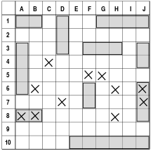
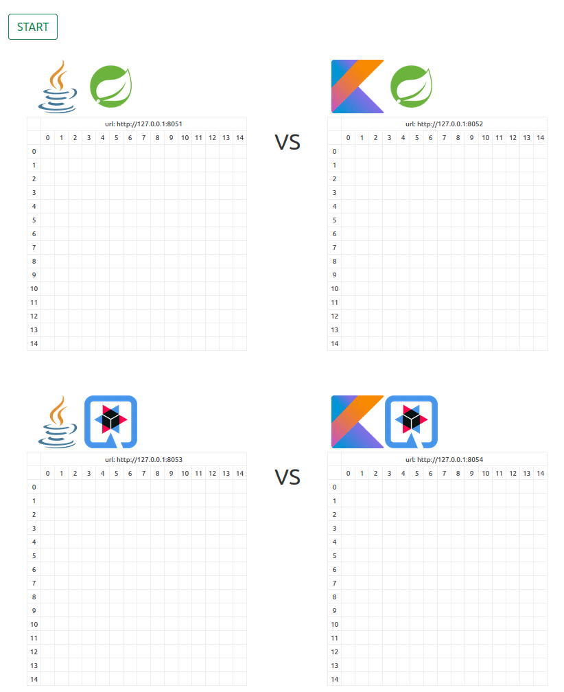

# Battleships 


Battleship (also known as Battleships or Sea Battle) is a strategy type guessing game for two players. 
You can find more info about the game on [WIKI](https://en.wikipedia.org/wiki/Battleship_(game)).

In our case, `technological stacks` will fight with each other - for example spring vs akka. 
This is the reason this project was made - **to play with vary technological stacks in a fun way**.

## Preliminary assumptions

1. there is possible scenario to have 1 vs 10 battle
2. you can watch the game by coordinator web page
3. each player is containerized, so You can run whole battle on local or remote docker machine


## C4 model

Plese click [here](doc/c4.md) to see C4 model .


## Current stacks

- [coordinator/vueCoordinator](coordinator/vueCoordinator) - simple GUI, application written in Vue 3+, Bootstrap
- [javaSpringShip](javaSpringShip) - application written in Java 11 + Spring boot 2.7 
- [javaQuarkusShip](javaQuarkusShip) - application writen in Java 11 + Quarkus 2.11 
- [kotlinSpringShip](kotlinSpringShip) - application written in Kotlin 1.6.21 + Spring boot 2.7 
- [core](core) - core , simplyfy creating specific stack app (see above)

# Run

You have to run at least two opponents and coordinator. You don't need maven, npm or any other developer tools ... all You need is docker.
 
Please type:

```
docker-compose up
```

or to build from sources

```
docker-compose -f docker-compose-with-build.yml up --build
```

Next go to [coordinator page at localhost:8080](http://localhost:8080) and click `Start`



wait and see how apps are fighting


